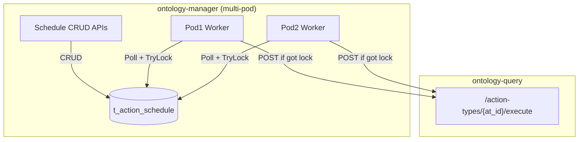
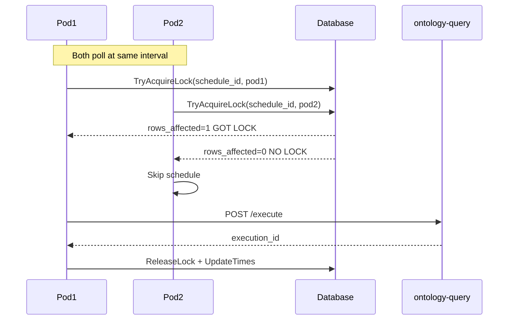
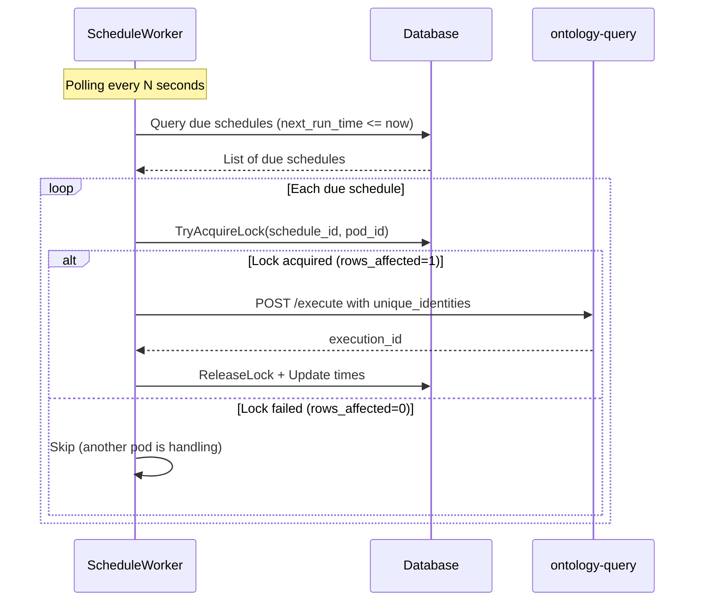

# Scheduled Action Plan Implementation

## Overview

Add scheduled action management to ontology-manager with:

- Database table for storing schedule definitions
- CRUD APIs for schedule management
- Worker that polls due schedules and triggers ontology-query execution
- Schedule states: `active` / `inactive`

## Architecture




**Key**: Only ONE pod acquires the lock and executes; others skip.

## Data Model

### New Table: `t_action_schedule`


| Column                      | Type         | Description                                  |
| --------------------------- | ------------ | -------------------------------------------- |
| f_id                        | VARCHAR(40)  | Schedule ID (PK)                             |
| f_name                      | VARCHAR(100) | Schedule name                                |
| f_kn_id                     | VARCHAR(40)  | Knowledge network ID                         |
| f_branch                    | VARCHAR(40)  | Branch                                       |
| f_action_type_id            | VARCHAR(40)  | Action type to execute                       |
| f_cron_expression           | VARCHAR(100) | Standard 5-field cron (min hour dom mon dow) |
| f_unique_identities         | MEDIUMTEXT   | JSON array of target objects                 |
| f_dynamic_params            | MEDIUMTEXT   | JSON object of dynamic params                |
| f_status                    | VARCHAR(20)  | `active` or `inactive`                       |
| f_last_run_time             | BIGINT(20)   | Last execution timestamp                     |
| f_next_run_time             | BIGINT(20)   | Next scheduled run timestamp                 |
| **f_lock_holder**           | VARCHAR(64)  | Pod ID holding lock (NULL = unlocked)        |
| **f_lock_time**             | BIGINT(20)   | Lock timestamp (for timeout detection)       |
| f_creator/f_updater         | VARCHAR(40)  | Audit fields                                 |
| f_create_time/f_update_time | BIGINT(20)   | Timestamps                                   |


## Multi-Pod Distributed Lock Strategy

**Problem**: Multiple pods may execute the same schedule simultaneously.

**Solution**: Database-based optimistic locking via `f_lock_holder` + `f_lock_time`.

### Lock Acquisition (Atomic SQL)

```sql
UPDATE t_action_schedule 
SET f_lock_holder = :pod_id, f_lock_time = :now
WHERE f_id = :schedule_id 
  AND f_status = 'active'
  AND f_next_run_time <= :now
  AND (f_lock_holder IS NULL OR f_lock_time < :now - :lock_timeout)
```

- Only ONE pod succeeds (DB row-level lock guarantees atomicity)
- Stale locks auto-release after timeout (default 5 min)
- Pod ID = `os.Hostname()` or UUID

### Lock Release (after execution)

```sql
UPDATE t_action_schedule 
SET f_lock_holder = NULL, f_lock_time = 0,
    f_last_run_time = :now, f_next_run_time = :calculated_next
WHERE f_id = :schedule_id AND f_lock_holder = :pod_id
```

### Worker Flow with Locking




## API Design

### ontology-manager APIs


| Method | Path                                                                | Description         |
| ------ | ------------------------------------------------------------------- | ------------------- |
| POST   | `/knowledge-networks/{kn_id}/action-schedules`                      | Create schedule     |
| GET    | `/knowledge-networks/{kn_id}/action-schedules`                      | List schedules      |
| GET    | `/knowledge-networks/{kn_id}/action-schedules/{schedule_id}`        | Get schedule        |
| PUT    | `/knowledge-networks/{kn_id}/action-schedules/{schedule_id}`        | Update schedule     |
| DELETE | `/knowledge-networks/{kn_id}/action-schedules/{schedule_ids}`       | Delete schedules    |
| PUT    | `/knowledge-networks/{kn_id}/action-schedules/{schedule_id}/status` | Activate/deactivate |


### ontology-manager Internal API (for query to pull)


| Method | Path                                                     | Description       |
| ------ | -------------------------------------------------------- | ----------------- |
| GET    | `/in/v1/knowledge-networks/{kn_id}/action-schedules/due` | Get due schedules |


## Implementation Structure

### ontology-manager New Files


| File                                                                                                                                         | Purpose                     |
| -------------------------------------------------------------------------------------------------------------------------------------------- | --------------------------- |
| [interfaces/action_schedule.go](ontology-manager/server/interfaces/action_schedule.go)                                                       | Schedule DTOs and constants |
| [interfaces/action_schedule_access.go](ontology-manager/server/interfaces/action_schedule_access.go)                                         | ScheduleAccess interface    |
| [interfaces/action_schedule_service.go](ontology-manager/server/interfaces/action_schedule_service.go)                                       | ScheduleService interface   |
| [drivenadapters/action_schedule/action_schedule_access.go](ontology-manager/server/drivenadapters/action_schedule/action_schedule_access.go) | DB access layer             |
| [logics/action_schedule/action_schedule_service.go](ontology-manager/server/logics/action_schedule/action_schedule_service.go)               | Business logic              |
| [driveradapters/action_schedule_handler.go](ontology-manager/server/driveradapters/action_schedule_handler.go)                               | HTTP handlers               |
| [driveradapters/validate_action_schedule.go](ontology-manager/server/driveradapters/validate_action_schedule.go)                             | Request validation          |
| [worker/schedule_worker.go](ontology-manager/server/worker/schedule_worker.go)                                                               | Cron-based scheduler        |
| [errors/action_schedule.go](ontology-manager/server/errors/action_schedule.go)                                                               | Error codes                 |
| [locale/action_schedule.*.toml](ontology-manager/server/locale/)                                                                             | i18n messages               |


### ontology-manager Modified Files


| File                                                                           | Changes                    |
| ------------------------------------------------------------------------------ | -------------------------- |
| [driveradapters/routers.go](ontology-manager/server/driveradapters/routers.go) | Add schedule routes        |
| [logics/driven_access.go](ontology-manager/server/logics/driven_access.go)     | Add schedule access        |
| [main.go](ontology-manager/server/main.go)                                     | Initialize schedule worker |
| [go.mod](ontology-manager/server/go.mod)                                       | Add robfig/cron v3         |


### Database Migration

New file: `migrations/mariadb/0.2.0/pre/action_schedule.sql`

## Execution Flow (with Distributed Lock)




## Key Dependencies

- `github.com/robfig/cron/v3` - For parsing cron expressions and calculating next run times (NOT for in-process scheduling)

## Worker Configuration


| Config                       | Default | Description                         |
| ---------------------------- | ------- | ----------------------------------- |
| `schedule_poll_interval`     | 10s     | How often to poll for due schedules |
| `schedule_lock_timeout`      | 5m      | Stale lock auto-release timeout     |
| `schedule_execution_timeout` | 10m     | Max time for a single execution     |


