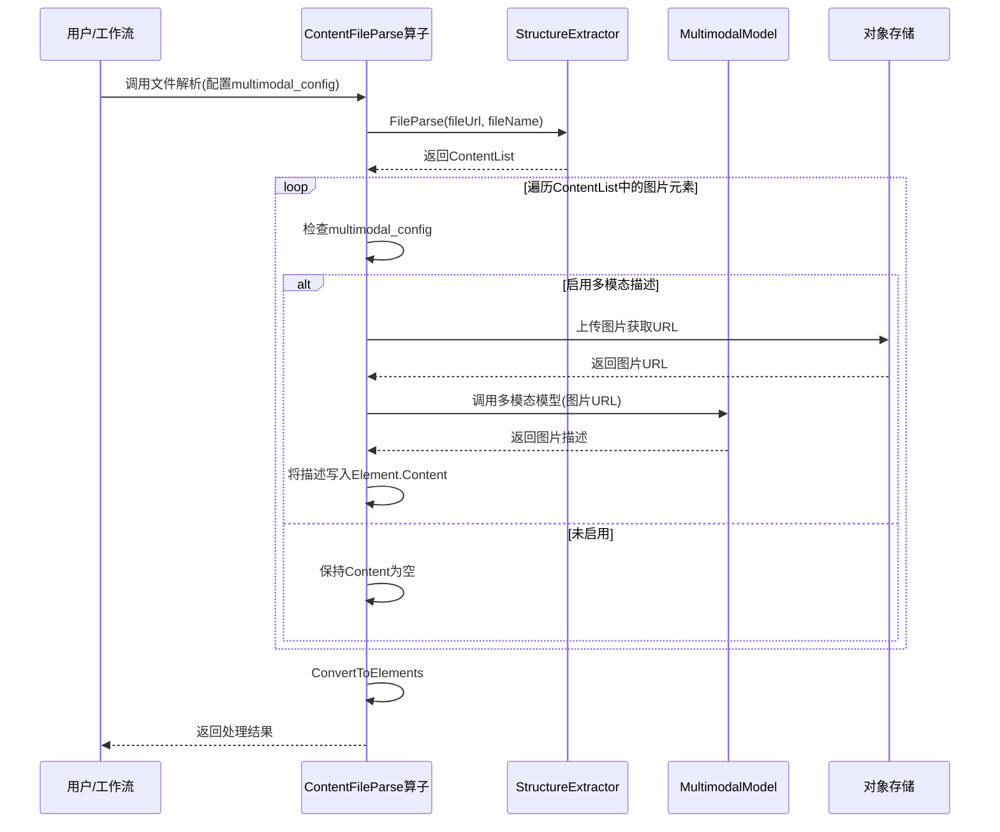

# 逻辑设计文档:文件解析过程中支持多模态模型生成图片描述

## 1. 需求概述

在文件解析过程中,支持配置多模态模型(如 GPT-4V、Claude Vision 等)对图片进行分析,生成语义化描述,并将描述存储到对应元素的 `content` 字段中。

### 核心目标

1. **增强内容理解**:为图片提供文本描述,便于全文检索和语义理解
2. **支持多模态检索**:结合图片描述和图片向量,实现更精准的检索
3. **提升用户体验**:在文档预览和摘要生成时,能够展示图片的语义信息
4. **可配置性**:用户可以选择是否启用该功能,以及使用哪个多模态模型

### 适用范围

- 适用于所有通过 `ContentFileParse` 算子进行文件解析的场景
- 支持的文件类型:PDF和图片等包含图片的文档格式

## 2. 配置参数

在 `ContentFileParse` 算子中新增多模态配置参数(平铺展示):

```go
type ContentFileParse struct {
    SourceType  SourceType  `json:"source_type"`
    DocID       string      `json:"docid"`
    Version     string      `json:"version"`
    Filename    string      `json:"filename"`
    Url         string      `json:"url"`
    SliceVector SliceVector `json:"slice_vector"`
    Model       string      `json:"model"`
    
    // 新增:多模态配置(平铺展示)
    // 是否启用多模态图片描述
    MultimodalEnabled bool `json:"multimodal_enabled,omitempty"`
    
    // 多模态模型标识(如 "gpt-4-vision-preview", "claude-3-opus", "gemini-pro-vision")
    MultimodalModelName string `json:"multimodal_model_name,omitempty"`
    
    // 提示词模板(由前端传递默认值)
    MultimodalPromptTemplate string `json:"multimodal_prompt_template,omitempty"`
}
```

### 2.1 前端获取可用模型

前端在配置多模态功能时,需要从模型管理接口获取支持视觉能力的多模态模型列表:

**API 端点**: `GET /api/mf-model-manager/v1/llm/list?page=1&size=1000`

**请求头**:
```
Authorization: Bearer {token}
```

**筛选条件**:
- 筛选 `model_type` 为 `"vu"` (Vision Understanding) 的模型

**响应示例**:
```json
{
  "data": [
    {
      "model_id": "gpt-4-vision-preview",
      "model_name": "GPT-4 Vision Preview",
      "provider": "openai",
      "model_type": "vu",
      "status": "active"
    },
    {
      "model_id": "claude-3-opus",
      "model_name": "Claude 3 Opus",
      "provider": "anthropic",
      "model_type": "vu",
      "status": "active"
    },
    {
      "model_id": "gemini-pro-vision",
      "model_name": "Gemini Pro Vision",
      "provider": "google",
      "model_type": "vu",
      "status": "active"
    }
  ],
  "total": 3
}
```

前端应将 `model_id` 作为 `multimodal_model_name` 的可选值。

## 3. 实现方案

### 3.1 整体流程图



### 3.2 核心流程

1. 文件解析完成后,遍历 `ContentList` 中的图片元素
2. 如果启用多模态配置(`multimodal_enabled=true`),则:
   - 上传图片到 OSS 获取公网 URL
   - 调用模型工厂的 `ChatCompletion` 接口生成图片描述
   - 将描述写入 `ContentItem.Text` 字段(后续转换为 `Element.Content`)
3. 使用 goroutine 池并发处理图片(默认最多5个并发)
4. 如果部分图片描述生成失败,记录警告但不中断整体流程

### 3.2 模型调用

通过现有的 `AnyData.ChatCompletion` 接口调用多模态模型:

```go
// 构建消息:包含文本提示词和图片URL
messages := []*drivenadapters.ChatMessage{
    {
        Role: "user",
        Content: []map[string]any{
            {"type": "text", "text": promptTemplate},
            {"type": "image_url", "image_url": map[string]string{"url": imageURL}},
        },
    },
}

// 调用模型工厂
res, err := ad.ChatCompletion(ctx, &drivenadapters.ChatCompletionRequest{
    Model:     modelName,
    Messages:  messages,
    MaxTokens: 500,
}, token)
```

## 4. 错误处理

| 错误类型 | 处理策略 |
|---------|---------|
| 图片上传失败 | 记录警告,跳过该图片 |
| 模型API调用失败 | 记录警告,跳过该图片 |
| 模型API超时(30秒) | 记录警告,跳过该图片 |
| 配置参数错误 | 记录警告,禁用多模态功能 |

**降级策略**:如果多模态服务完全不可用,回退到原有流程(图片 Content 为空)

## 5. 示例工作流配置

### 5.1 基本配置

```yaml
name: "文档解析与图片描述生成"
steps:
  - name: "解析文档"
    operator: "content_file_parse"
    params:
      source_type: "docid"
      docid: "{{input.docid}}"
      version: "{{input.version}}"
      slice_vector: "slice_vector"
      model: "bge-large-zh"
      multimodal_enabled: true
      multimodal_model_name: "gpt-4-vision-preview"
      multimodal_prompt_template: "请详细描述这张图片的内容,包括主要对象、场景、颜色、布局等信息。"
```

### 5.3 默认提示词模板参考

**中文**:
```
请详细描述这张图片的内容,包括:
1. 主要对象和场景
2. 颜色和布局
3. 图片类型(照片、图表、示意图等)
4. 其他重要细节

请用简洁、准确的语言描述,不超过200字。
```

**英文**:
```
Please provide a detailed description of this image, including:
1. Main objects and scene
2. Colors and layout
3. Image type (photo, chart, diagram, etc.)
4. Other important details

Please use concise and accurate language, no more than 200 words.
```

## 6. 兼容性说明

- **默认行为不变**:如果不配置 `multimodal_enabled` 或设置为 `false`,行为与现有版本完全一致
- **数据结构兼容**:`Element` 结构无破坏性变更,仅填充原有的 `Content` 字段
- **API兼容**:`ContentFileParse` 算子参数向后兼容,新增参数为可选
