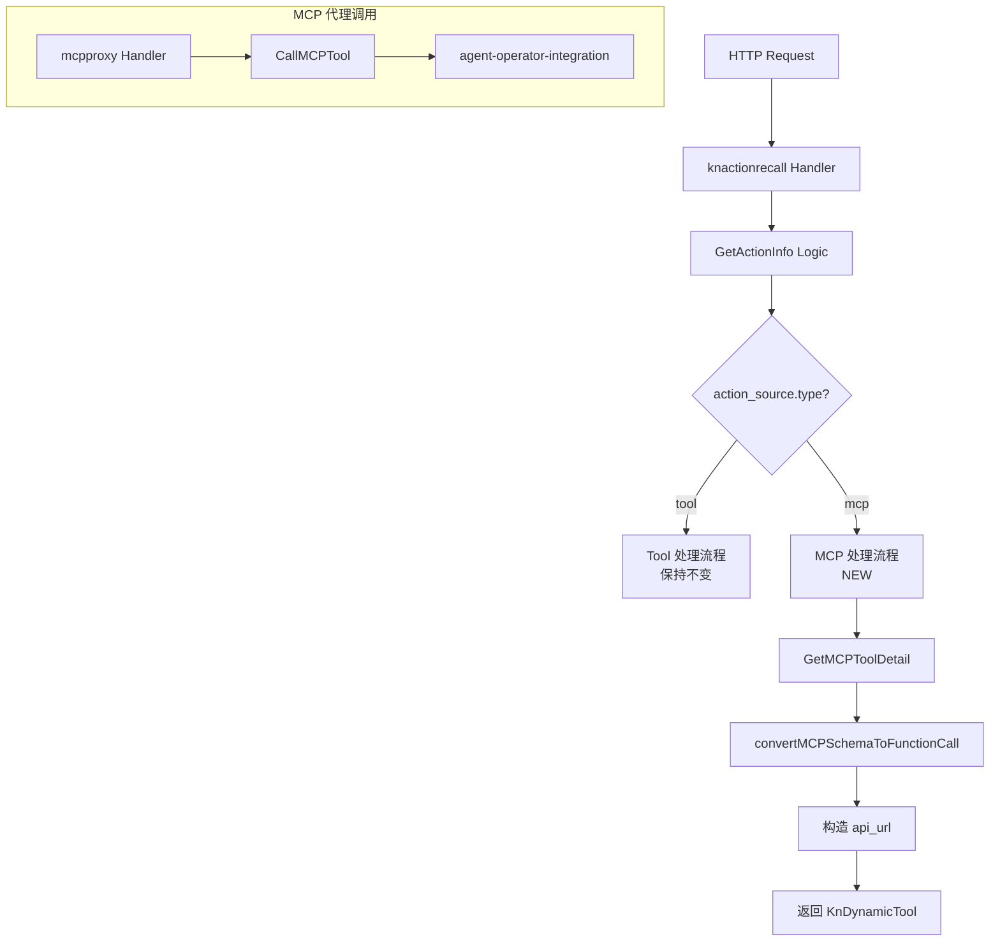
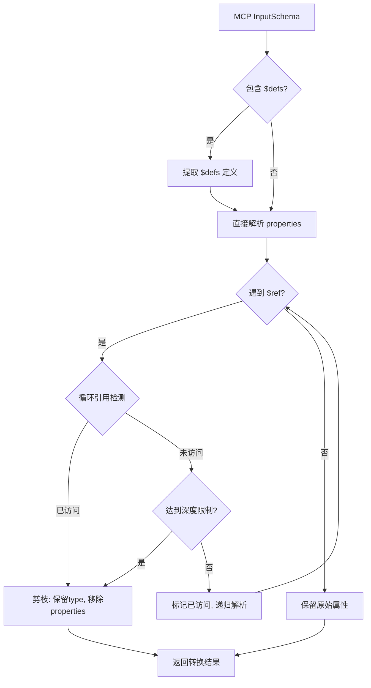

# feature-803607: MCP 类型行动召回支持 - 实现设计文档

## 文档信息

| 项目 | 内容 |
|------|------|
| **需求编号** | feature-803607 |
| **关联需求文档** | [需求设计文档.md](./需求设计文档.md) |
| **文档版本** | v1.0 |
| **创建日期** | 2026-01-19 |
| **状态** | 待评审 |

---

## 1. 概述

本文档详细描述 MCP 类型行动召回功能的技术实现方案，包括架构设计、接口变更、核心算法、测试范围和部署方案。

### 1.1 设计目标

1. **扩展现有架构**：复用 feature-799472 的分层架构，新增 MCP 处理分支
2. **最小化变更**：仅修改必要的接口和逻辑，保持向后兼容
3. **易于测试**：核心算法（Schema 转换）可独立单元测试

### 1.2 设计原则

- **单一职责**：Schema 转换、代理调用分离
- **开放封闭**：通过类型判断分流，不修改现有 Tool 逻辑
- **优雅降级**：Schema 解析失败时提供兜底

---

## 2. 架构设计

### 2.1 分层架构图

```
┌─────────────────────────────────────────────────────────────────┐
│                     Driver Adapters (HTTP)                       │
│  ┌─────────────────────┐    ┌──────────────────────────────────┐ │
│  │ knactionrecall/     │    │ mcpproxy/                        │ │
│  │   index.go          │    │   index.go (NEW)                 │ │
│  └─────────────────────┘    └──────────────────────────────────┘ │
├─────────────────────────────────────────────────────────────────┤
│                     Business Logic                               │
│  ┌─────────────────────────────────────────────────────────────┐ │
│  │ logics/knactionrecall/                                      │ │
│  │   get_action_info.go  (MODIFIED: MCP 分支)                  │ │
│  │   schema_converter.go (MODIFIED: MCP Schema 转换)           │ │
│  └─────────────────────────────────────────────────────────────┘ │
├─────────────────────────────────────────────────────────────────┤
│                     Driven Adapters                              │
│  ┌─────────────────────────────────────────────────────────────┐ │
│  │ drivenadapters/operator_integration.go                      │ │
│  │   - GetMCPToolDetail (NEW)                                  │ │
│  │   - CallMCPTool (NEW)                                       │ │
│  └─────────────────────────────────────────────────────────────┘ │
├─────────────────────────────────────────────────────────────────┤
│                     Interfaces                                   │
│  ┌─────────────────────────────────────────────────────────────┐ │
│  │ interfaces/kn_action_recall.go                              │ │
│  │   - ActionSource (MODIFIED: 新增 McpID, ToolName)           │ │
│  │ interfaces/driven_operator_integration.go                   │ │
│  │   - GetMCPToolDetailRequest/Response (NEW)                  │ │
│  │   - CallMCPToolRequest (NEW)                                │ │
│  └─────────────────────────────────────────────────────────────┘ │
└─────────────────────────────────────────────────────────────────┘
```

### 2.2 数据流图



---

## 3. 接口定义变更

### 3.1 ActionSource 结构体扩展

**文件**: `server/interfaces/kn_action_recall.go`

```go
// ActionSource Action Source
type ActionSource struct {
    Type     string `json:"type"`                // tool/mcp
    BoxID    string `json:"box_id"`              // Tool Box ID (type=tool)
    ToolID   string `json:"tool_id"`             // Tool ID (type=tool)
    McpID    string `json:"mcp_id,omitempty"`    // MCP ID (type=mcp) - NEW
    ToolName string `json:"tool_name,omitempty"` // Tool Name (type=mcp) - NEW
}
```

### 3.2 MCP 相关接口新增

**文件**: `server/interfaces/driven_operator_integration.go`

```go
// GetMCPToolDetailRequest Get MCP tool detail request
type GetMCPToolDetailRequest struct {
    McpID    string
    ToolName string
}

// GetMCPToolDetailResponse Get MCP tool detail response
type GetMCPToolDetailResponse struct {
    Name        string                 `json:"name"`
    Description string                 `json:"description"`
    InputSchema map[string]interface{} `json:"inputSchema"`
    Annotations map[string]interface{} `json:"annotations"`
}

// CallMCPToolRequest Call MCP tool request
type CallMCPToolRequest struct {
    McpID      string                 `json:"mcp_id"`
    ToolName   string                 `json:"tool_name"`
    Parameters map[string]interface{} `json:"parameters"`
}

// DrivenOperatorIntegration interface
type DrivenOperatorIntegration interface {
    GetToolDetail(ctx context.Context, req *GetToolDetailRequest) (*GetToolDetailResponse, error)
    GetMCPToolDetail(ctx context.Context, req *GetMCPToolDetailRequest) (*GetMCPToolDetailResponse, error) // NEW
    CallMCPTool(ctx context.Context, req *CallMCPToolRequest) (map[string]interface{}, error)              // NEW
}
```

---

## 4. 核心逻辑设计

### 4.1 GetActionInfo MCP 分支

**文件**: `server/logics/knactionrecall/get_action_info.go`

**伪代码**:
```go
if actionsResp.ActionSource.Type == "mcp" {
    // 1. 获取 MCP 工具详情
    toolDetail := operatorIntegration.GetMCPToolDetail(mcpID, toolName)
    
    // 2. 构造 API URL (完整地址，指向 AR 代理接口)
    apiURL := fmt.Sprintf("http://%s:%d/api/agent-retrieval/in/v1/mcp/proxy/%s/tools/%s/call",
        config.Project.Name, config.Project.Port, mcpID, toolName)
    
    // 3. 固定参数 (扁平化)
    fixedParams := firstAction.Parameters  // 直接使用，无需分层
    
    // 4. Schema 转换
    parameters := convertMCPSchemaToFunctionCall(toolDetail.InputSchema)
    
    // 5. 构建返回
    return KnDynamicTool{...}
}
```

### 4.2 MCP 代理接口设计

**文件**: `server/driveradapters/mcpproxy/index.go`

**路由**: `POST /api/agent-retrieval/in/v1/mcp/proxy/:mcp_id/tools/:tool_name/call`

#### 设计目的

| 设计点 | 说明 |
|--------|------|
| 参数扁平化 | LLM 直接传递扁平化 JSON，无需理解上下游封装格式 |
| URL 编码 | mcp_id 和 tool_name 编码在 URL 中，减少 LLM 参数复杂度 |
| 统一封装 | AR 负责将扁平参数封装为 AOI 要求的 `{tool_name, parameters}` 格式 |

#### 实现逻辑

```go
func (h *mcpProxyHandler) CallMCPTool(c *gin.Context) {
    mcpID := c.Param("mcp_id")
    toolName := c.Param("tool_name")
    
    var parameters map[string]interface{}
    c.ShouldBindJSON(&parameters)
    
    req := &CallMCPToolRequest{
        McpID:      mcpID,
        ToolName:   toolName,
        Parameters: parameters,
    }
    
    resp := operatorIntegration.CallMCPTool(ctx, req)
    c.JSON(200, resp)
}
```

---

## 5. Schema 转换算法

### 5.1 算法概述

MCP 使用 JSON Schema (Draft 2020-12)，可能包含 `$defs` 和 `$ref`。OpenAI Function Call 对 Schema 支持有限，需将引用解析并内联。

### 5.2 转换流程



### 5.3 关键配置

| 配置项 | 值 | 说明 |
|--------|-----|------|
| MaxSchemaDepth | 3 | 最大递归深度 |
| $ref 前缀 | `#/$defs/` | MCP Schema 引用格式 |

### 5.3.1 统一解析器设计（重构方案）

> [!IMPORTANT]
> MCP 的 `$ref` 解析逻辑与现有 OpenAPI 的解析逻辑保持一致，通过 **通用解析器 + RefResolver 策略参数化** 实现代码复用，减少约 85 行重复代码。

**核心设计**：

```go
// RefResolver 引用解析器函数类型
// 作用：根据 $ref 路径查找并返回被引用的 Schema 定义
type RefResolver func(refPath string) (map[string]interface{}, error)

// resolveSchemaWithResolver 通用 Schema 解析函数
func (s *knActionRecallServiceImpl) resolveSchemaWithResolver(
    ctx context.Context,
    schema map[string]interface{},
    refResolver RefResolver,  // 引用查找策略
    visitedRefs map[string]bool,
    currentDepth int,
) (map[string]interface{}, error)
```

**类型差异对比**：

| 特性 | OpenAPI | MCP |
|------|---------|-----|
| 引用格式 | `#/components/schemas/Name` | `#/$defs/Name` |
| 查找位置 | `apiSpec["components"]["schemas"]` | `inputSchema["$defs"]` |
| 通用逻辑 | 循环检测、深度控制、剪枝 | 完全复用 |

**MCP 调用方式**：

```go
func (s *knActionRecallServiceImpl) convertMCPSchemaToFunctionCall(...) {
    // 构建 MCP 专用的引用解析器
    mcpRefResolver := func(refPath string) (map[string]interface{}, error) {
        prefix := "#/$defs/"
        name := strings.TrimPrefix(refPath, prefix)
        if def, ok := rootDefs[name].(map[string]interface{}); ok {
            return def, nil
        }
        return nil, fmt.Errorf("MCP schema definition not found: %s", name)
    }
    
    // 使用通用解析器
    return s.resolveSchemaWithResolver(ctx, inputSchema, mcpRefResolver, visitedRefs, 0)
}
```

### 5.4 剪枝策略

当检测到循环引用或达到深度限制时：
1. ✅ 保留 `type` 字段
2. ✅ 保留 `description` 字段
3. ❌ 移除 `properties` 字段（终止递归）

### 5.5 示例

**输入**:
```json
{
    "$defs": {
        "Node": {
            "type": "object",
            "properties": {
                "value": {"type": "string"},
                "child": {"$ref": "#/$defs/Node"}
            }
        }
    },
    "properties": {
        "root": {"$ref": "#/$defs/Node"}
    }
}
```

**输出**:
```json
{
    "type": "object",
    "properties": {
        "root": {
            "type": "object",
            "properties": {
                "value": {"type": "string"},
                "child": {"type": "object"}  // 剪枝：无 properties
            }
        }
    }
}
```

---

## 6. 文件变更清单

| 文件 | 类型 | 变更说明 |
|------|------|----------|
| `interfaces/kn_action_recall.go` | 修改 | ActionSource 新增 McpID/ToolName |
| `interfaces/driven_operator_integration.go` | 修改 | 新增 MCP 相关接口定义 |
| `drivenadapters/operator_integration.go` | 修改 | 实现 GetMCPToolDetail/CallMCPTool |
| `logics/knactionrecall/get_action_info.go` | 修改 | 新增 MCP 分支逻辑 |
| `logics/knactionrecall/schema_converter.go` | 修改 | 新增 convertMCPSchemaToFunctionCall |
| `driveradapters/mcpproxy/index.go` | **新增** | MCP 代理 Handler |
| `driveradapters/rest_private_handler.go` | 修改 | 注册 MCP 代理路由 |
| `infra/localize/locales/zh-Hans.json` | 修改 | 更新错误提示文本 |
| `infra/localize/locales/en-US.json` | 修改 | 更新错误提示文本 |

---

## 7. 测试范围

### 7.1 单元测试

| 测试文件 | 测试内容 | 优先级 |
|---------|---------|--------|
| `schema_converter_test.go` | MCP Schema 转换 | P0 |
| | - 简单 Schema 转换 | |
| | - $defs 引用解析 | |
| | - 循环引用检测和剪枝 | |
| | - 深度限制剪枝 | |
| `get_action_info_test.go` | MCP 分支逻辑 | P0 |
| | - type=mcp 时进入 MCP 分支 | |
| | - API URL 格式正确 | |
| | - fixed_params 扁平化 | |

### 7.2 集成测试

| 测试场景 | 验证点 | 依赖 |
|---------|--------|------|
| MCP 行动召回 | 完整流程正确 | Ontology Query, AOI |
| | - 工具详情获取成功 | |
| | - Schema 转换正确 | |
| | - 响应格式正确 | |
| MCP 代理调用 | 请求转发正确 | AOI |
| | - 参数封装正确 | |
| | - 响应透传正确 | |

### 7.3 异常测试

| 测试场景 | 预期行为 |
|---------|----------|
| MCP 工具不存在 | 返回 404 |
| MCP 服务不可用 | 返回 502 |
| Schema 格式错误 | 返回 500 + 详细日志 |
| 参数校验失败 | 返回 400 |

### 7.4 回归测试

| 测试场景 | 验证点 |
|---------|--------|
| Tool 类型行动召回 | 功能不受影响 |
| | - 接口请求/响应兼容 |
| | - 处理逻辑正确 |

---

## 8. 风险与缓解措施

| 风险 | 影响 | 概率 | 缓解措施 |
|------|------|------|----------|
| AOI MCP 接口不稳定 | 功能不可用 | 中 | 超时控制 + 错误日志 |
| Schema 格式超出预期 | 转换失败 | 低 | 兜底返回 + 详细日志 |
| 深度嵌套导致性能问题 | 响应慢 | 低 | 深度限制 (3 层) |
| 循环引用导致栈溢出 | 服务崩溃 | 低 | 访问标记 + 循环检测 |

---

## 9. 部署与回滚方案

### 9.1 部署步骤

1. **配置检查**
   - 确认 AOI 服务地址配置正确
   - 确认 MCP 代理接口所需的 Header 配置

2. **滚动部署**
   - 使用 Kubernetes 滚动更新
   - 先部署 1 个 Pod 验证功能

3. **功能验证**
   - 调用行动召回接口，验证 MCP 类型返回正确
   - 调用代理接口，验证请求转发正确

### 9.2 回滚方案

| 触发条件 | 回滚操作 |
|---------|----------|
| 新功能异常 | 回滚到上一版本镜像 |
| 影响现有功能 | 紧急回滚 + 问题排查 |

**回滚命令**:
```bash
kubectl rollout undo deployment/agent-retrieval
```

### 9.3 监控告警

| 监控项 | 阈值 | 告警级别 |
|--------|------|----------|
| MCP 代理接口错误率 | > 5% | P1 |
| MCP 代理接口延迟 | P99 > 3s | P2 |
| Schema 转换失败率 | > 1% | P2 |

---

## 10. 修订历史

| 版本 | 日期 | 修改人 | 修改内容 |
|------|------|--------|----------|
| v1.0 | 2026-01-19 | - | 初始版本 |
