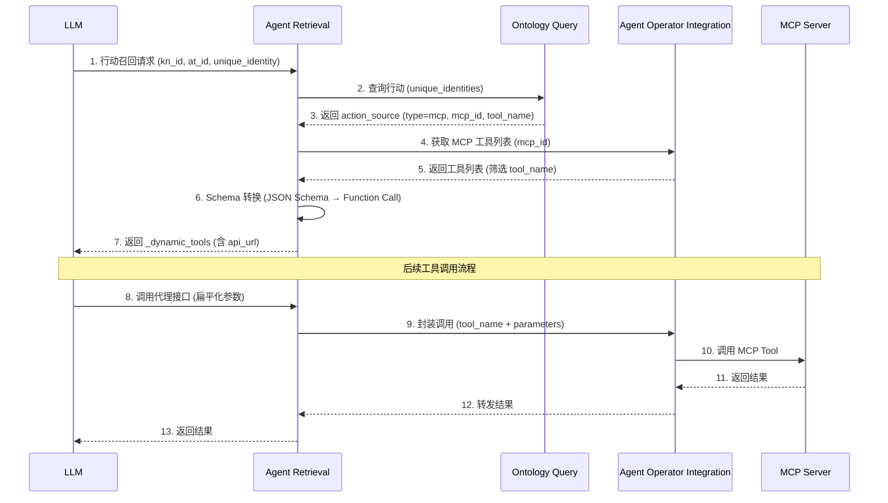

# feature-803607: MCP 类型行动召回支持

## 文档信息

| 项目 | 内容 |
|------|------|
| **需求编号** | feature-803607 |
| **基线版本** | feature-799472 (Tool 类型行动召回) |
| **文档版本** | v1.0 |
| **创建日期** | 2026-01-19 |
| **状态** | 待评审 |

---

## 1. 背景与目标

### 1.1 业务背景

在 Agent Retrieval 服务中，**行动召回**（Action Recall）功能负责从业务知识网络中检索与特定对象关联的可执行行动，并将其转换为 LLM 可理解的工具定义格式（OpenAI Function Call Schema）。

feature-799472 实现了 `type=tool` 类型的行动召回，支持通过 **工具箱（Toolbox）** 中定义的 OpenAPI 规范工具。但随着 **MCP（Model Context Protocol）** 生态的发展，需要扩展支持 MCP 类型的工具召回。

### 1.2 MCP 简介

MCP (Model Context Protocol) 是一种标准化的模型上下文协议，允许 AI 模型与外部工具和数据源进行交互。与传统的 OpenAPI 工具相比：

| 特性 | OpenAPI Tool | MCP Tool |
|------|-------------|----------|
| Schema 格式 | OpenAPI 3.0 | JSON Schema (Draft 2020-12) |
| 参数结构 | 分层 (header/path/query/body) | 扁平化 |
| 服务管理 | 工具箱管理 | MCP Server 管理 |

### 1.3 需求来源

- **产品需求**：支持接入 MCP 生态的工具，扩展 Agent 的能力边界
- **技术需求**：统一的行动召回接口，屏蔽 Tool/MCP 类型差异

---

## 2. 功能性需求

### 2.1 需求清单

| 需求ID | 需求名称 | 优先级 | 描述 |
|--------|---------|--------|------|
| FR-001 | MCP 类型识别 | P0 | 识别 `action_source.type = mcp` 并进入 MCP 处理流程 |
| FR-002 | MCP 工具详情获取 | P0 | 通过 agent-operator-integration 获取 MCP 工具的 Schema |
| FR-003 | MCP Schema 转换 | P0 | 将 JSON Schema (含 $defs) 转换为 OpenAI Function Call 格式 |
| FR-004 | MCP 代理接口 | P0 | 提供代理接口封装 LLM 对 MCP 工具的调用 |
| FR-005 | 参数扁平化 | P0 | MCP 的 fixed_params 以扁平 Map 格式返回 |
| FR-006 | 循环引用处理 | P1 | Schema 转换时检测并处理循环引用 |

### 2.2 需求详细说明

#### FR-001: MCP 类型识别

**描述**：当 Ontology Query 返回的 `action_source.type = mcp` 时，系统应进入 MCP 处理流程。

**输入**：
```json
{
    "action_source": {
        "type": "mcp",
        "mcp_id": "ad3ca391-a598-4764-a6c8-e62b9662e87e",
        "tool_name": "generate_disease_treatment_plan"
    }
}
```

**验收标准**：
- ✅ 正确识别 type=mcp 并进入 MCP 分支
- ✅ 正确提取 mcp_id 和 tool_name

---

#### FR-002: MCP 工具详情获取

**描述**：调用 agent-operator-integration 的 MCP 代理接口获取工具列表，并筛选指定工具。

**依赖接口**：`GET /api/agent-operator-integration/internal-v1/mcp/proxy/{mcp_id}/tools`

**验收标准**：
- ✅ 成功调用 AOI 获取工具列表
- ✅ 从列表中正确筛选指定 tool_name
- ✅ 工具不存在时返回 404 错误

---

#### FR-003: MCP Schema 转换

**描述**：将 MCP 工具的 inputSchema (JSON Schema 格式) 转换为 OpenAI Function Call Parameters 格式。

**转换规则**：
1. 解析 `$defs` 中的类型定义
2. 递归解析 `$ref` 引用并内联
3. 检测循环引用并执行剪枝（保留类型、移除 properties）
4. 限制最大递归深度（默认 3 层）

**验收标准**：
- ✅ 简单 Schema 正确转换
- ✅ 含 $defs 的 Schema 正确解析引用
- ✅ 循环引用场景不会无限递归
- ✅ 移除结果中的 $defs（已内联）

**技术设计决策 - 统一 Schema 解析器**：

> [!IMPORTANT]
> MCP 的 `$ref` 解析逻辑与现有 OpenAPI 转 OpenAI 的逻辑保持一致，通过 **通用解析器 + 引用查找策略参数化** 实现代码复用。

| 类型 | 引用格式 | 查找位置 |
|------|---------|---------|
| OpenAPI | `#/components/schemas/Name` | `apiSpec["components"]["schemas"]` |
| MCP | `#/$defs/Name` | `inputSchema["$defs"]` |

两者的核心递归逻辑（循环检测、深度控制、剪枝策略）完全一致，仅引用路径格式不同。通过 `RefResolver` 函数类型参数化实现统一。

#### FR-004: MCP 代理接口

**描述**：提供统一的代理接口，封装 LLM 对 MCP 工具的调用。

**接口**：`POST /api/agent-retrieval/in/v1/mcp/proxy/{mcp_id}/tools/{tool_name}/call`

> [!NOTE]
> 返回的 `api_url` 是完整地址：`http://{service_name}:{port}/api/agent-retrieval/in/v1/mcp/proxy/{mcp_id}/tools/{tool_name}/call`
> - `service_name`：使用配置的服务名称（如 `agent-retrieval`）
> - `port`：使用配置的服务端口

**设计目的**：
1. **参数扁平化**：LLM 直接传递扁平化 JSON，无需理解 MCP 协议封装格式
2. **URL 编码关键信息**：mcp_id 和 tool_name 编码在 URL 中，减少 LLM 参数传递复杂度
3. **统一转发**：Agent Retrieval 封装参数后转发给 AOI

**验收标准**：
- ✅ 正确解析 URL 中的 mcp_id 和 tool_name
- ✅ 正确封装请求体为 AOI 要求的格式
- ✅ 正确转发请求并返回响应

---

#### FR-005: 参数扁平化

**描述**：与 Tool 类型不同，MCP 类型的 fixed_params 以扁平化 Map 格式返回。

**对比**：
```
// Tool 类型 fixed_params (分层)
{
    "header": {"x-account-id": "..."},
    "path": {"disease_id": "..."},
    "query": {},
    "body": {}
}

// MCP 类型 fixed_params (扁平)
{
    "disease_id": "disease_000001",
    "include_drugs": "true"
}
```

**验收标准**：
- ✅ MCP 类型返回扁平 Map
- ✅ 调用方可直接将 fixed_params 与 LLM 生成的参数合并

---

## 3. 非功能性需求

### 3.1 性能需求

| 指标 | 要求 | 说明 |
|------|------|------|
| 响应时间 | ≤ 2000ms | 包含 AOI 调用和 Schema 转换 |
| Schema 转换 | ≤ 100ms | 单个 Schema 转换耗时 |
| 递归深度 | 最大 3 层 | 防止深层嵌套导致性能问题 |

### 3.2 可靠性需求

| 指标 | 要求 | 说明 |
|------|------|------|
| 循环引用处理 | 100% 检测 | 不会因循环引用导致栈溢出 |
| 错误处理 | 优雅降级 | 单个属性解析失败不影响整体 |

### 3.3 可观测性需求

| 需求 | 描述 |
|------|------|
| 日志记录 | 关键步骤记录 Debug 日志，错误场景记录 Error 日志 |
| 错误追踪 | 错误日志包含 mcp_id、tool_name、错误详情 |

### 3.4 兼容性需求

| 需求 | 描述 |
|------|------|
| 向后兼容 | 不影响现有 type=tool 的行动召回功能 |
| 接口兼容 | 行动召回接口的请求/响应格式保持兼容 |

### 3.5 安全需求

| 需求 | 描述 |
|------|------|
| 认证透传 | 透传请求头中的认证信息给 AOI |
| 参数校验 | 校验 mcp_id 和 tool_name 非空 |

---

## 4. 业务流程

### 4.1 整体流程图



### 4.2 与 Tool 类型的差异

| 步骤 | Tool 类型 | MCP 类型 |
|------|----------|----------|
| 工具详情获取 | 调用 AOI 的 Toolbox 接口 | 调用 AOI 的 MCP Proxy 接口 |
| Schema 来源 | OpenAPI api_spec | JSON Schema inputSchema |
| fixed_params 格式 | 分层结构 | 扁平 Map |
| 代理执行 | 直接调用 AOI Toolbox Proxy | 通过 AR 代理接口中转 |

---

## 5. 接口规范

### 5.1 行动召回接口（扩展）

**端点**：`POST /api/agent-retrieval/in/v1/kn/get_action_info`

**Query 参数**：
| 参数 | 类型 | 必填 | 说明 |
|------|------|------|------|
| kn_id | string | 是 | 知识网络 ID |
| at_id | string | 是 | 行动类型 ID |

**请求头**：
| 参数 | 类型 | 必填 | 说明 |
|------|------|------|------|
| x-account-id | string | 是 | 账户 ID |
| x-account-type | string | 是 | 账户类型 |

**请求体**：
```json
{
    "unique_identity": {
        "disease_id": "disease_000001"
    }
}
```

**响应体**（MCP 类型）：
```json
{
    "headers": {
        "x-account-id": "bdb78b62-6c48-11f0-af96-fa8dcc0a06b2",
        "x-account-type": "user"
    },
    "_dynamic_tools": [
        {
            "name": "generate_disease_treatment_plan",
            "description": "基于疾病ID生成个性化治疗方案...",
            "parameters": {
                "type": "object",
                "properties": {
                    "disease_id": {
                        "type": "string",
                        "description": "疾病编号"
                    },
                    "patient_age": {
                        "type": "integer",
                        "description": "患者年龄"
                    }
                }
            },
            "api_url": "http://agent-retrieval:30779/api/agent-retrieval/in/v1/mcp/proxy/ad3ca391-.../tools/generate.../call",
            "original_schema": { "..." },
            "fixed_params": {
                "disease_id": "disease_000001",
                "include_drugs": "true"
            },
            "api_call_strategy": "kn_action_recall"
        }
    ]
}
```

---

### 5.2 MCP 代理接口（新增）

**端点**：`POST /api/agent-retrieval/in/v1/mcp/proxy/{mcp_id}/tools/{tool_name}/call`

**路径参数**：
| 参数 | 类型 | 说明 |
|------|------|------|
| mcp_id | string | MCP Server ID |
| tool_name | string | 工具名称 |

**请求体**：扁平化参数 JSON
```json
{
    "disease_id": "disease_000001",
    "patient_age": 45,
    "severity": "moderate"
}
```

**响应体**：透传 AOI 响应
```json
{
    "content": [
        {
            "type": "text",
            "text": "{\"treatment_plan\": {...}}"
        }
    ],
    "isError": false
}
```

---

## 6. 依赖接口

### 6.1 Ontology Query - 行动查询

**接口**：`POST /api/ontology-query/in/v1/knowledge-networks/{kn_id}/action-types/{at_id}`

**MCP 类型响应示例**：
```json
{
    "action_source": {
        "type": "mcp",
        "mcp_id": "ad3ca391-a598-4764-a6c8-e62b9662e87e",
        "tool_name": "generate_disease_treatment_plan"
    },
    "actions": [
        {
            "parameters": {
                "disease_id": "disease_000001",
                "include_drugs": "true"
            },
            "dynamic_params": {
                "patient_age": null
            }
        }
    ]
}
```

### 6.2 Agent Operator Integration - MCP 代理

| 接口 | 方法 | 用途 |
|------|------|------|
| `/internal-v1/mcp/proxy/{mcp_id}/tools` | GET | 获取 MCP 工具列表 |
| `/internal-v1/mcp/proxy/{mcp_id}/tool/call` | POST | 调用 MCP 工具 |

---

## 7. 错误处理

| 错误场景 | HTTP 状态码 | 错误码 | 处理方式 |
|---------|-------------|--------|----------|
| 不支持的行动源类型 | 400 | ErrExtActionRecallUnsupportedType | 返回明确错误 |
| MCP 工具不存在 | 404 | ErrExtActionRecallToolNotFound | 返回工具名称 |
| MCP 服务调用失败 | 502 | ErrExtActionRecallMCPCallFailed | 返回上游错误 |
| Schema 转换失败 | 500 | ErrExtActionRecallSchemaConvertFailed | 记录详细日志 |
| 参数校验失败 | 400 | - | 返回校验详情 |

---

## 8. 验收标准

### 8.1 功能验收

| 验收项 | 验收标准 | 验收方式 |
|--------|---------|----------|
| MCP 类型识别 | type=mcp 时进入 MCP 处理流程 | 单元测试 |
| 工具详情获取 | 正确获取并筛选工具 | 集成测试 |
| Schema 转换 | $defs 正确解析，循环引用正确剪枝 | 单元测试 |
| 代理接口 | 正确封装转发请求 | 集成测试 |
| 参数扁平化 | fixed_params 为扁平 Map | 接口测试 |
| 错误处理 | 各错误场景返回正确状态码 | 异常测试 |

### 8.2 非功能验收

| 验收项 | 验收标准 | 验收方式 |
|--------|---------|----------|
| 响应时间 | P99 ≤ 2000ms | 性能测试 |
| 兼容性 | 不影响现有 Tool 类型功能 | 回归测试 |
| 日志完整性 | 关键步骤有日志记录 | 日志审查 |

---

## 9. 术语表

| 术语 | 英文 | 说明 |
|------|------|------|
| 行动召回 | Action Recall | 从知识网络检索可执行行动并格式化的功能 |
| 行动源 | Action Source | 标识行动来源的结构，包含类型和标识信息 |
| MCP | Model Context Protocol | 模型上下文协议，用于 AI 模型与外部工具交互 |
| JSON Schema | - | 用于描述 JSON 数据结构的规范 |
| $defs | - | JSON Schema 中定义可重用类型的字段 |
| $ref | - | JSON Schema 中引用其他定义的字段 |
| 剪枝 | Pruning | Schema 转换时处理循环引用的策略 |

---

## 10. 修订历史

| 版本 | 日期 | 修改人 | 修改内容 |
|------|------|--------|----------|
| v1.0 | 2026-01-19 | - | 初始版本 |
